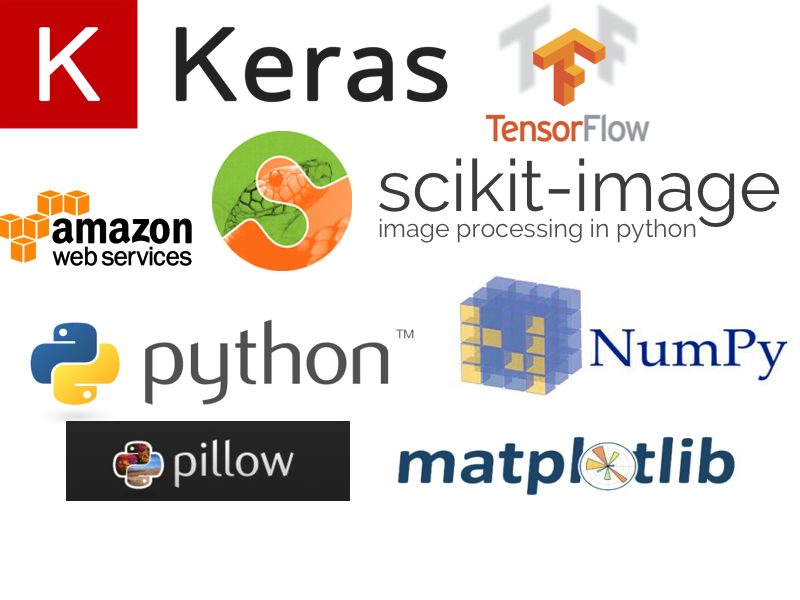

# GANs: Not always Black and White

Colorizing black and white photos is currently a painstaking and labor-intensive process. It has to be done manually in photoshop by a skilled graphic designer and the whole process can take a long time because it relies on the designer's imagination and efficiency to produce a realistic colorization.

GAN's can circumvent this by developing their own "intuition" over thousands of training iterations. This "intuition" helps them recognize patterns in images and apply the correct colorization. This project seeks to build a GAN in Keras that can accomplish this.

## Table of Contents
1. [What is a GAN?](#what-is-a-gan?)
2. [How to train a GAN?](#how-to-train-a-gan?)
3. [Color Spectrums](#color-spectrums)
    *  [RGB](#rgb)
    *  [CIE-LAB](#cie-lab)
4. [Model Architecture](#model-Architecture)
    *  [Generator](#Generator)
    *  [Discriminator](#Discriminator)
    *  [GAN](#gan)
5. [Data](*data)
6. [Results](#results)
7. [Tech Stack](#tech-stack)

## What is a GAN

A generative adversarial network or "GAN" is a neural network consisting of two submodels. These models work together to generate something, could be an image or even music, that to humans seems like the "real" thing.

The first submodel is the "Generator" and the second is the "Discriminator." After being pre-trained on what is real and what is noise, the Discriminator trains the Generator by revealing to it when it has created something realistic and when it hasn't. At first, the Generator will produce mostly noise, but eventually it will fool the Discriminator.

There are lots of types of GANs that researchers have given creative names to, such as DCGANs, HyperGans, CycleGANs, and S^2-GANs. Each are tweaked in certain ways to be more suitable to a specific task. However, all share the core principle of one net training the other to generate novel content.

## How to Train a GAN

## Color

### RGB
Most images use the RGB colorspace. The disadvantage of using RGB when colorizing images is that the model needs to predict 3 values for each pixel.

### CIE-LAB

This project will be utilizing the CIE-LAB color space to preserve the gray scaled image. As shown in the picture below, the gray scaled images is simply the L value in LAB. Therefore, the generator will use the L spectrum as input and predict A and B. To view the results, the L layer is added back in and LAB had to be converted to RGB.

## Model Architecture

### Generator

The goal of the Generator is to create content so indistinguishable from the training set that the Discriminator cannot tell the difference.

Below is the basic structure of the Generator. Each encoding layer is a Convolution layer with stride 2 followed by a Batch Normalization layer and then a Leaky ReLU activation layer of slope .2. Each decoding layer is a an Upsampling layer followed by a convolution layer, Batch Normalization, and finally the concatenation layer.

The arrows illustrate the concatenation layers that help preserve the structure of prominent edges that the decoding layers identified. These are called skip connections and are prevalent when finding the mapping between an input image and the output image.

### Discriminator

The goal of the Discriminator is to be the expert on what a true image looks like. If it is fooled by the Discriminator too early then it is not doing its job well enough and as a result, will not be able to train the Generator well.

### GAN

Here is a summary of the overall GAN architecture.

|Layer           |Output Shape       | Params      |
|----------------|-------------------|-------------|
|Input           |(None, 32, 32, 1)  |0            |
|Generator       |(None, 32, 32, 2)  |205,794      |
|Discriminator   |(None,1)           |23585        |

Total params: 229,379 
Trainable params: 205,154 
Non-trainable params: 24,225 

## Data

I used two datasets for this project. The first was of my own making. For simplicity, I created simple images of shapes, where each shape is a different color.

The second dataset was a subset of the CIFAR-10 dataset. I used only images classified as having ships because they were the most consistent. They are usually mostly blue and the ships are usually a gray or white.

## Results

Ground Truth | Grayscaled Image | Colorized

 

#### How does it do on a more complex example?  

##### Forest Landscape
Ground Truth | Grayscaled Image | Colorized  

##### Mountain Landscape
Ground Truth | Grayscaled Image | Colorized  

## Tech Stack

